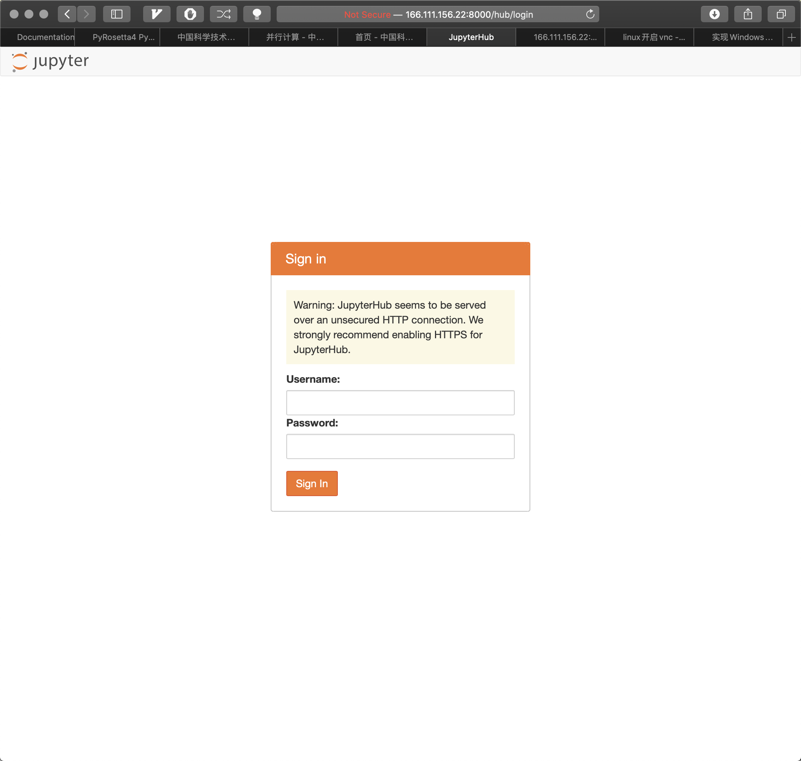

<!--
 * @Description: 
 * @Version: 
 * @School: Tsinghua Univ
 * @Date: 2020-01-05 16:04:09
 * @LastEditors  : Xie Yufeng
 * @LastEditTime : 2020-01-06 01:44:31
 -->
# rotation_zhulab
***
## Record work every week and save in `./Progress`
### Dec_28_2019
#### MSA-based approach development
Selecting the appropriate mutation site based on the information of protein evolution
* mutiple sequence alignment
* distance map --> hydrogen bond ditinguish
* 3D visualization
#### MSA-independent approach exploration
information beyond protein evolution: mutation?

see detail in 

<object data="./Progress/Dec_28_2019.pdf" width="700px" height="700px"> 
    <embed src="./Progress/Dec_28_2019.pdf"> 
     This browser does not support PDFs. Please download the PDF to view it: <a href="./Progress/Dec_28_2019.pdf">Download PDF</a>.</p> 
    </embed> 
</object> 

#### server&cluster env
##### cluster
install `rosetta` on cluster, `pyrosetta` failed because of error `GLIBC.2.17 not found`, contact Anbao and solve the problem
##### server
install `jupyterhub` and we can type `http://166.111.156.22:8000` on browsers and sign in our server. Do visualization work as we can: like `matplotlib` plotting
<div  align="center"> 

</div>


#### peer
Yunxin Xu in Haipeng Gong lab does similar work: de novo protein folding by `pyrosetta` and `trRosetta`, chat with him to promote my work
### Jan_06_2019
aim: mutate, Ile, split(know what is split, previous method about split in reading_list)
paper reading about split 
#### MSA-based approach 
* mutiple sequence alignment (experienced but to do)
* distance map --> hydrogen bond ditinguish (to do, not too hard)
* 3D visualization (doing)

##### server (`166.111.156.22`)

`teamviewer`(desktop remote) linux service
`pymol` 
so we can open `PDB` file on server and have a vision of protein 3D structure 
##### trRosetta
from sequence file to PDB file 
```
python trRosetta.py T1008.npz T1008.fasta model.pdb
```
`T1008.npz` is like distance map, can also derive from fasta
so we can have 3D visualization of mutant protein.
#### website (zhulab)
software | function
-|-
nginx |  can browse `IP:port` to get data in computer (modify `nginx.conf`)
Vscode | install `live server` plugin to see website in-time and modify `html` file and see direct effect

update new `html` file to the website-server
***
## learning
Data structure
Parallel Computing

